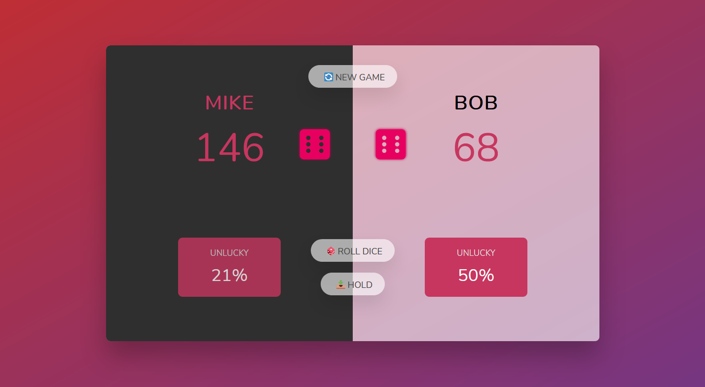

# [Pig-Game](https://michal-w-dev.github.io/Pig-Game/)

 2 Players game. To win the game one of the players needs to collect one hundred points. 

 In each throw player gathers current points, which can be collected by hold button, then the turn will change. 

 Throwing 1 on both dice reset current points and change turn. 

 Throwing 1 on one die reduce points by 1/3 and change turn. 

 If one of the players achieve one hundred points, the unlucky factor will be displayed (percentage of how many times each player threw 1 for all throws they had). The probability of throwing 1 is around 31%, that means the player can be considered unlucky if their 'unlucky factor' is above that number. The player with higher unlucky factor can still be victorious. 

 

